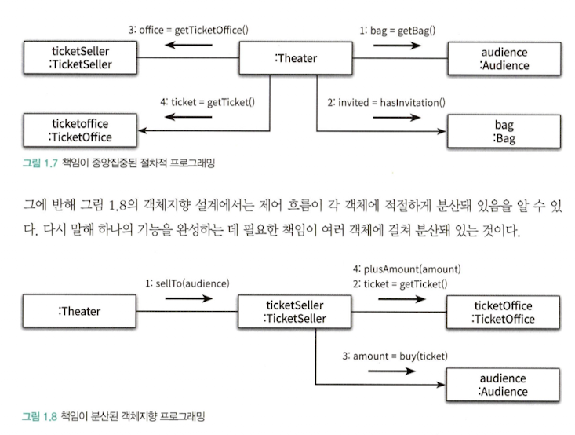

# chapter-01

# 소프트 웨어 모듈의 세 가지 목적 by Robert C. Martin

1. 실행 중 제대로 동작할 것
2. 변경을 위해 존재할 것 → 변경에 대응할 수 있을 것
3. 코드를 읽는 사람과 의사소통이 가능할 것 → readability 가 확보되어야 한다

# 다시 한 번, 자율 / 책임 / 역할 / 협력

- ticket selling service 를 설계하면서, 저자는 이전 저서인 ‘객체지향의 사실과 오해' 에서 강조한 자율 / 책임 / 역할 / 협력 을 강조하였다.
    - 비판적으로 받아들이라고 이야기 하였으나, 아직까지는 합리적이라고 생각이 들어 일단은 받아들이고 있다.
- 특히, `encapsulization` 의 효용 중, `implementation` 와 `interface` 를 구분한다는 효용을 다시 한 번 깨달을 수 있었다.
    - 현실 속의 우리가 협력을 할 때 하나하나 사사건건 간섭하는 것보다, 어떤 책임과 역할을 부여하고, 그를 수행하기 위한 행동과, 행동을 실천하는 신호로서의 메시지를 보내 자율적으로 일을 하는 게 좀 더 능률이 좋은 모습을 떠올랐다.
- 추가로, 객체지향이란 현실에 대한 묘사가 아니라 현실에 대한 은유라는 걸 다시 한 번 깨달을 수 있었다.
    - 극장(`Theater`) 는 표를 판다, 관객은 표를 산다, 여기까지는 우리 일상 속의 범주에서 이해할 수 있다.
    - 그러나 ‘가방이 표를 보관한다 ‘ 라는 건 인간 기준 관점에서는 이해할 수 없다. 왜냐면, 가방은 인간에 의해 움직이는, 의식이 없는 수동적인 존재이기 때문이다.
    - 하지만 객체지향 코드에서는, 가방에게도 역할과 책임, 그리고 행동과 메시지를 부여한다.
    
    ```tsx
    export class Bag {
      constructor(
        private amount: number,
        private invitation: Invitation,
        private ticket: Ticket
      ) {}
    
      private setTicket(ticket: Ticket) {
        this.ticket = ticket;
      }
    
      private minusAmount(amount: number) {
        this.amount -= amount;
      }
    
      private plusAmount(amount: number) {
        this.amount += amount;
      }
    
      public hasInvitation() {
        return this.invitation !== null;
      }
    
      public hasTicket() {
        return this.ticket !== null;
      }
    
      public hold(ticket: Ticket) {
        if (this.hasInvitation()) {
          this.setTicket(ticket);
        }
        this.setTicket(ticket);
        this.minusAmount(ticket.getFee());
        return ticket.getFee();
      }
    }
    ```
    
    - 가방을 묘사한 코드인 `Bag` 이다. 가방은 `hold` 라는 method 를 통해, ticket 을 보관할 수 있는데, `invitation` 이 없는 경우 `minusAmount` 를 통해 돈을 지불하고 ticket 을 할당(`setTicket`)하고, invitation 이 있는 경우엔 `minusAmount` 가 필요 없이 바로 ticket 을 할당 한다.
    - 외부에서는 가방의 구체적인 구현 사항에 대해서 알 필요가 없다. 가방은 `hold` 라는 행위를 통해 다른 객체들과 협력하며, ticket 을 구매하고자 하는 message 가 들어오는 경우, 그에 대해 `hold` 라는 행위로 역할과 책임을 다할 뿐이다.
- 프로세스와 데이터를 별도로 구분하는 모듈인 절차 지향 (`procedural programming`) 프로그래밍과 달리, 객체지향은 프로세스와 데이터가 하나로 합쳐져 있다.
    - 이전의 clean architecture 에서 본 `entity` 라는 개념이 떠오른다. core business data 와 core business rule 을 하나로 합쳐서 만든 `enitty` 란 개념이 모든 architecture 의 핵(core)이 된다고. 그리고 그 수단은 무엇이든 상관없고, 단지 Java 를 위시한 객체지향 언어에서는 `class` 를 통해서 감싼다고.



- 가장 처음, `enter` 라는 method 안에서 `Theater`, `Audience`, `TicketSeller` 등을 data 로서 받아 작동시켰던 방식(위)은 `Theater` 가 많은 책임을 지고 있다. 그래서, `Theater` 는 audience 의 변경도, bag 의 변경도, ticketOffice 의 변경도, 그리고 ticketSeller 의 변경도 전부 알아야 한다. 그렇기에, 변경에 취약하다. 직접 조작하였으니 더더욱 말이다.
- 그러나, `Theater` 가 `sellTo` 라는 행위(interface)를 통해 `ticketSeller` 에게 의존하고, `ticketSeller` 도 마찬가지로 interface 를 통해 audience 와 ticketOffice 와 의존(소통) 하는 과정에서, Theater 에 집중된 책임은 분산되었고, 더욱 자율적인 객체간의 소통으로 문제를 풀어나갈 수 있게 되었다.

# 그 외 인상깊었던 저자의 어록들

> 변경 가능한 코드란 이해하기 쉬운 코드다. 만약 여러분이 어떤 코드를 변경해야 하는데, 그 코드를 이해할 수 없다면 어떻겠는가? 그 코드가 변경에 유연하다고 하더라도, 아마 코드를 수정하겠다는 마음이 선뜻 들지는 않을 것이다.
> 

> 객체지향의 세계에서 애플리케이션은 객체들로 구성되며, 애플리케이션의 기능은 객체들 간의 상호작용을 통해 구현된다. 그리고 객체 사이의 상호작용은 객체 사이에 주고 받는 메시지로 표현된다.
> 

> 훌륭한 객체지향 설계란, 협력하는 객체 사이의 의존성을 적절하게 관리하는 설계다. 세상에 엮인 것이 많은 사람일수록 변하기 어려운 것처럼, 객체가 실행되는 주변 환경에 강하게 결합될수록 변경하기 어려워 진다. 객체 간의 의존성은 애플리케이션을 수정하기 어렵게 만드는 주범이다.
>