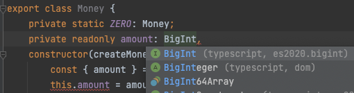

# chapter-02

# 모르는 것들, 명확히 다시 하고싶은 것들 정리

## No silver bullet

- 상속과 합성, 추상화와 구체화 중 어느 한 쪽이 무조건 맞는 것은 아니다. 이 부분에서도 은탄환이란 존재하지 않는다.
- clean architecture 에서 fan in / fan out 을 통해 그린 component abstract / dependency index 와 main sequence 를 설명하면서 나온 구절을 다시 한 번 떠올려보자, ‘안정적이어야 하는만큼 추상적이어야 한다'

## inheritance and composition

### inheritance

- 상속은 class 간의 결합을 통해 강하게 결합을 이루어내는 방식이며, child class 가 parent class 의 implemtation part 나 interface part 를 전부 다 알아버리는 만큼, ‘필요한 만큼만 보여준다' 라는 capsulization 을 위배하기 쉽게 만든다

### composition

- 반면 합성의 경우, interface (message) 간의 결합을 통해 약하게 결합을 이뤄내는 방식이며, interface 를 사용하기에 필요한 만큼만 보여주게 된다

## overriding, overloading

### overriding

- 부모 class 에서 정의된 같은 이름, 같은 parameter 목록을 가진 method 를 자식 class 에서 재정의 하는 것을 가리킨다
- abstract class 를 extends 하여 실제로 구현했을 때 abstract method 를 구현하는 게 overriding 의 대표적인 에시이다

### overloading

- method 의 이름은 같지만, parameter 의 목록이 다른 경우, parameter 의 종류에 따른 여러 method 들이 존재하는 상황을 의미한다
- `TypeORM` 에서 `findOne` method 를 호출할 때 input 이 `DeepPartial<T>` 인지, `Entity<T>` 인지 따라 동적으로 다르게 정의된 method 들이 호출되는 게 overloading 의 대표적인 예시이다. 04

## template method pattern

> 부모 클래스에 기본적인 알고리즘의 흐름을 구현하고, 중간에 필요한 처리를 자식 클래스에 위임하는 디자인 패턴을 `template method pattern` 이라고 한다
> 
- 이 책에서는 굳이 instance 가 만들어질 필요가 없기에, 부모 class 를 `abstract class` 로 만들었다
- 그리고 그 안의 protected public method 를 자식 class 에서 override 하여 사용하는 방식으로 처리하였다
    - `AbstractDiscountPolicy` → `AmountDiscountPolicy` 로 흐름이 넘어간다

## protected

> `protected` members are only visible to subclasses of the class they’re declared in. - TypeScript docs
> 
- 어떤 class 의 member 를 정의할 때 앞에 `protected` 를 붙이면, 해당 class 를 상속하지 않은 class 에서는 해당 member 를 사용할 수 없게 된다.

## final

- `java` 등의 OOP 기반 언어에서 제공하는 ‘기능' (맥락에 따라서 달라질 수 있기 때문)

### variable with final

- 수정을 할 수 없는 constant variable 을 만드는 데 사용한다

### method with final

- 마찬가지로, method overriding 을 할 수 없는 method 를 만드는 데 사용한다

### class with final

- 마찬가지로, `extends` 등을 통해 inheritance 를 할 수 없는 class 를 지정하는 데 사용한다

### ETC

- java 에서 final 과 관련된 `property` naming 은 `ALL_CAPITAL` 인 거 같다
- final property 들은 값을 할당하여 생성과 동시에 특정 값으로 초기화 하는 과정을 겪지 않는 이상, 단 두 가지 방법만으로 값을 할당 받을 수 있다
    - `instance-initializer block`
    - `inside of constructor`
    - `static block`
    - 위를 제외한 상황에서 final property 에 재할당을 시도하고자 하면, `compile-time` error 를 반환한다.

## convert java code using final to typescript code

### java code

```java
// Money - Java code 
public class Money {
	public static final Money ZERO = Money.wons(0);
	
	private final BigDecimal amount;
	
	public static Money wons(long amount) {
		return new Money(BigDecimal.valueOf(amount));
	}

	Money(BigDecimal amount) {
		this.amount = amount;
	}

	public Money plus(Money amount) {
		return new Money(this.amount.add(amount.amount);
	}

	public Money times(double percent) {
		return new Money(this.amount.mulitply(
			BigDecimal.valueOf(percent)
		);
	}

	public boolean isLessThan(Money other) {
		return amount.compareTo(other.amount) < 0;
	}

	public boolean isGreaterThanOrEqual(Money other) {
		return amount.compareTo(other.amount) >= 0;
	}
```

### analysis

- `public static final ZERO: Money = Money.wons(0);`
    - 굳이 class 의 instance 를 생성하지 않고도 부를 수 있는 `Money` type 의 변수인 `ZERO` 가 선언된다
        - 그리고 이 `ZERO` 는 `final` keyword 가 붙은 property 인 만큼, 다른 곳에서 재할당이 불가능하다
    - `ZERO` 가 선언됨과 동시에, ZERO 는 `Money.wons(0)` 의 값이 할당된다.
- `amount: BigDecimal`
    
    
    
    - TypeScript 에는 `BigDecimal` 이라는 구현체는 존재하지 않고, JavaScript 에 최근에 추가된 primitive type 인 `BigInt` wrapper class 를 대안으로서 사용할 수 있을 듯 하다.
    
    ```tsx
    // tsconfig.json
    {
      "compilerOptions": {
    		//...
        /* Language and Environment */
        "target": "esnext",
    		//...
    	}
    }
    ```
    
    - 물론 이를 위해선, `tsconfig.json` 에서 `compilerOption` 의 `target` 을 `"esnext"` 라고 명시해 주어야 한다
    - 그러나, 정식적으로 지원하는 것이 아닌 만큼, 그냥 `number` 를 통해 class 를 만들고, 나중에 정말 21억 이상의 수가 필요해지는 경우 bigint 를 사용하기로 했다.

### typescript code

```tsx
export interface CreateMoneyDto {
  amount: number;
}

export class Money {
  public static ZERO = Money.wons(0);
  private readonly amount: number;
  constructor(createMoneyDto: CreateMoneyDto) {
    const { amount } = createMoneyDto;
    this.amount = amount;
  }

  public static wons(amount: number) {
    return new Money({ amount });
  }
  public plus(amount: Money) {
    return new Money({ amount: this.amount + amount.amount });
  }

  public minus(amount: Money) {
    return new Money({ amount: this.amount - amount.amount });
  }

  public times(percent: number) {
    return new Money({ amount: this.amount * percent });
  }

  public isLessThan(other: Money) {
    return this.amount < other.amount;
  }

  public isGreaterThanOrEqual(other: Money) {
    return this.amount >= other.amount;
  }
}
```