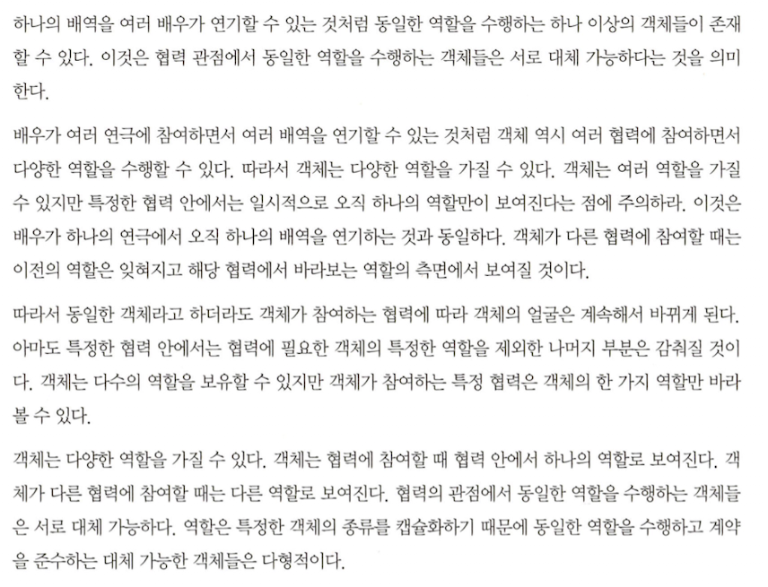

# chapter-03

# 전체적으로는

- 영화 예매 애플리케이션을 코드로 직접 구현해본 뒤, 역할과 책임, 그리고 협력에 대해서 돌아보는 숨고르기 구간이었다.

---

# 협력의 관점에서 바라보아라

- “어떠한 객체도 섬이 될 수 없다” 라는 말처럼, 객체지향 프로그래밍은 객체들의 협력을 통해 문제를 해결해 내는 것을 핵심 과제로 삼는다.
- 협력이라는 단어가 들어간 것처럼, 절차지향 프로그래밍과는 다르게 객체지향 프로그래밍은 각 객체(들)에게 협력이란 맥락 하에 책임을 분산하고, 메시지를 통해서 서로 협력을 하게끔 한다.

# 책임: 하는 것(doing) 과 아는 것(knowing)

- 영화 예매 애플리케이션에서 우리가 객체를 만들 때를 또 생각해보자
- 가장 먼저 ‘영화를 예매한다' 라는 역할을 해야 하므로, 예매하라(`reserve`)라는 메시지가 필요할 것이다
- 그리고 그 메시지를 받았을 때 행위로서 응답해야 하는 책임을 지닌 객체를 생각해보기로 하였고, 그 객체는 `Screening` 이라고 명명하기로 하였다.
- 해당 객체는 예매하라는 메시지를 수행하기 위해 예매를 하기 위해 필요한 것을 (doing) 해야 하며, 그 예매를 하기 위해 필요한 것들에 필요한 요소들을 알아야(knowing)한다.
- 책임은 메시지보다 조금 더 포괄적이고, 또 추상적인 주제이다. 중요한 것은, 책임의 관점에서 ‘아는 것' 과 ‘하는 것' 이 밀접하게 연관되어있다는 점이며, 이는 우리가 책임을 수행할 수 있는 객체를 만들기 위해 아는 것과 하는 것을 묶어놓아 그 안에서 자율적으로 처리가 가능하게끔 해야한다는 점을 시사한다.

# 메시지가 객체를 결정한다

- 객체지향은 현실에 대한 은유인 만큼, 우리들이 살고 있는 현실을 생각해보자.
    - 우리가 어떤 일을 해야할 때, 우리는 그 일에 대해서 먼저 생각하고 그 일을 맡길 역할(을 수행할 사람, 혹은 무언가)을 생각하지, 사람을 먼저 생각하고 일을 맡기진 않는다. (일반적으로는)
- 그렇기에, 책임이 객체를 결정한다 라는 명제가 참이라고 말할 수 있고, 더 나아가 책임의 전부 혹은 일부인 메시지 또한 객체를 결정하는 데 중요한 역할을 한다고도 말할 수 있다.

# 행동이 상태를 결정한다

- 행위를 먼저 생각하고, 그 행위에 필요한 부수적인 요소들을 생각해 보는 것처럼 객체지향 패러다임도 행위를 먼저 생각하고, 그 다음으로는 그 행위에 필요한 것들을 생각한다. (그리고, 행위 이전엔 메시지가, 또 책임이 존재할 것이다)
- 영화 예매라는 행위를 해야 하는 상황에서, 그 행위를 해야 하는 객체는 어떤 영화를 예매할지, 어떤 방식으로 예매할지에 대한 정보가 필요하다. 이 정보는 그 객체의 상태를 결정짓는 요소들이 된다.
- 그러한 이유로, 행동은 상태를 결정한다고 할 수 있다.

# 역할과 객체를 구분지어 생각하라

- 의존성으로서든, 아니면 단일적인(standalone) 존재로서든 우리가 객체를 생각하는 과정은
    - 그 책임에 필요한 역할을 찾는다
    - 그 역할에 필요한 객체를 찾는다
    
    로 세분화 될 수 있다.
    
- 영화 예매 애플리케이션 중, 할인 정책(`DiscountPolicy`)와 할인조건(`DiscountCondition`)이란 객체를 구현하기 이전, 이들을 역할로서 담을 수 있도록 `abstract class` 와 `interface` 를 사용한 것이 위 단락의 대표적인 예시이다
- 이렇게 역할과 객체를 구분하여 생각하게 된다면, 역할을 수행하기 위한 객체들을 유연하게 교체할 수 있고, 이를 통해 전체적으로 설계를 유연하게 한다는 장점이 생긴다

## 은 탄환은 없다, 여전히

- 그러나, 무조건 역할을 먼저 정의하고 나서 그 역할에 기반하여 객체를 만들 필요는 없다. 그 역할을 수행하는 게 하나의 객체만으로 충분하다면, 역할을 먼저 만들 필요 없이 객체를 먼저 만드는 것이 우선되어도 좋다.
- 로버트 마틴의 클린 아키텍처에서 또한 application lifecycle 에 따른 development strategy 에서 이 부분을 언급한다.
    - 개발 초창기에 많은 기능들이 바뀌어야 할 때는 개발 가능성(developability)이 우선되어야 한다. 왜냐하면, 빠르게 바뀌어 가는 세상에서 애플리케이션의 사업성을 검증하는 것이 더욱 중요한 시점이기 때문이다.
    - 그런 상황에서 무조건 공통적인 책임을 도출해 내어 역할을 정의하고, 그 역할에 기반하여 객체(concrete class)를 만드는 건 좋지 못한 전략일 수 있다.

---

# 저자의 비유 - 연극 속 배우와 배역

- 참 적절하게 비유를 한 거 같아서 그대로 인용해보려고 한다.

